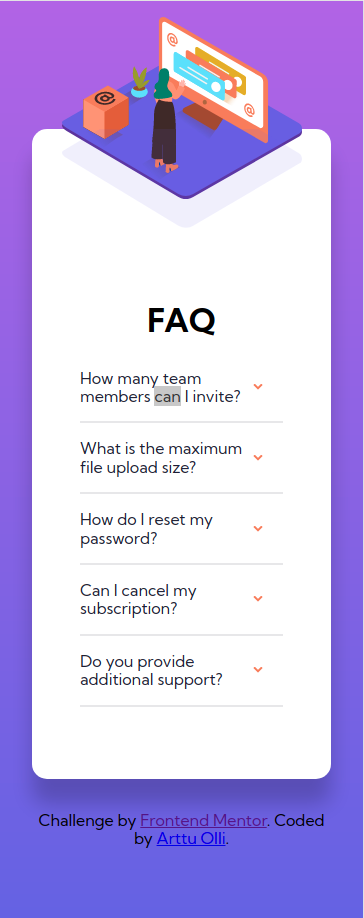
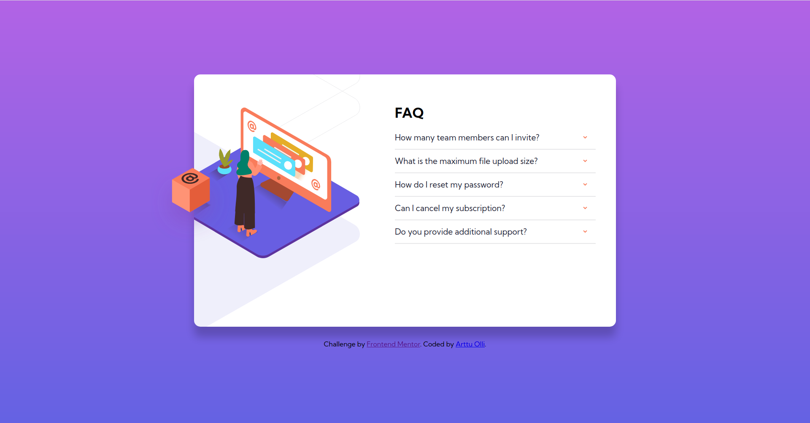

# Frontend Mentor - FAQ accordion card solution

This is a solution to
the [FAQ accordion card challenge on Frontend Mentor](https://www.frontendmentor.io/challenges/faq-accordion-card-XlyjD0Oam)
. Frontend Mentor challenges help you improve your coding skills by building realistic projects.

## Table of contents

- [The challenge](#the-challenge)
- [Screenshot](#screenshot)
- [Built with](#built-with)
- [What I learned](#what-i-learned)

### The challenge

Users should be able to:

- View the optimal layout for the component depending on their device's screen size
- See hover states for all interactive elements on the page
- Hide/Show the answer to a question when the question is clicked

### Screenshot




### Built with

- Semantic HTML5 markup
- SCSS

### What I learned

- Using hidden HTML elements to create more complex elements without Javascript. The accordion here is implemented with
  hidden checkboxes, the states of which I'm using to display or hide the answers, example below.

```html
<li>
  <input
    type="checkbox"
    name="faq_accordion"
    id="section1"
    class="accordion__input"
  />
  <label for="section1" class="accordion__label"
    >How many team members can I invite?</label
  >
  <p class="accordion__content">
    You can invite up to 2 additional users on the Free plan. There is no limit
    on team members for the Premium plan.
  </p>
  <hr class="divider" />
</li>
```

- Creating responsive layouts by avoiding fixed widths and heights and using max/min-width/height instead.
- Stacking images using relative and absolute positioning.
